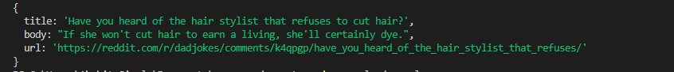

# Random Joke

## Code

```javascript
const somethingRandom = require('some-random-cat')
const Random = new somethingRandom()
Random.newJoke()
.then(res => console.log(res)) // The function returns a pending promise and can be logged using .then
.catch(e => console.error(e)) // Catch the error
```

## Output




